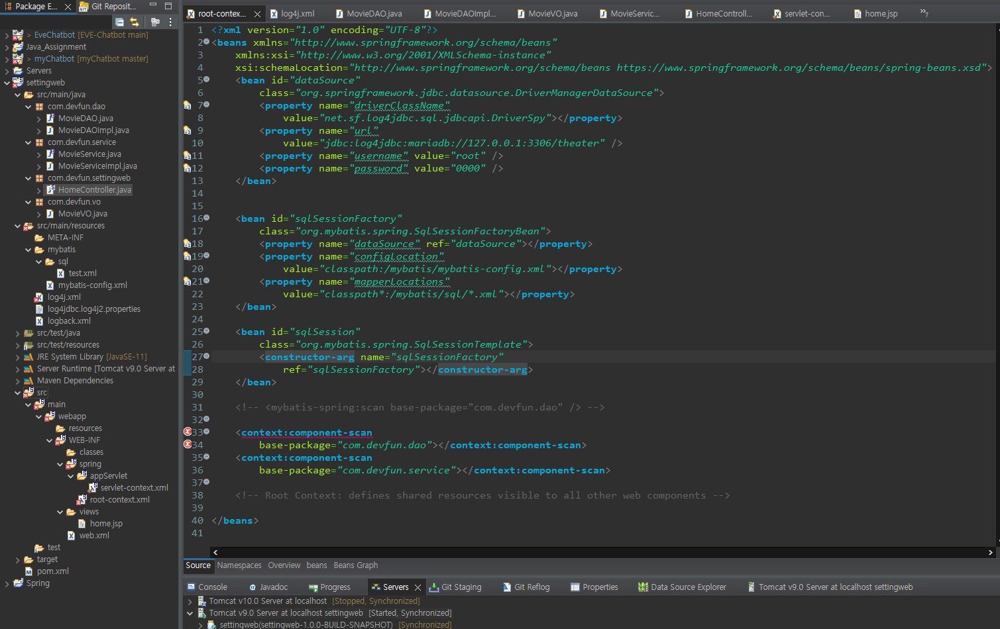

# Back-end-Develop-Practice

## 1st Assignment

Eclipse, Spring 설치

 JDK 1.8 설치 완료 

 

 Eclipse 설치 완료 

 

 Spring 설치 완료 

 

 Tomcat 설치 완료 

- 기존에 설치한 Tomcat v.10.0 Server 아래에 새로 설치하였다.

 

 mariadb, mysql Workbench 설치 및 샘플 DB 구축 

 

 스프링, Mariadb, MyBatis 연동, 데이터 조회 

- POM.xml 수정 완료
- root-context.xml **에러 발생**
- mybatis-config.xml 작성 완료
- logback.xml 작성 완료
- log4jdbc.log4j2.properties 작성완료
- test.xml 작성 완료

- MovieDAT.java, MovieDAOlmpl.java 작성 완료
- MovieService.java, MovieServicelmpl.java 작성완료
- HomeController.java 작성완료
- MovieVO.java 작성완료
- Tomcat 세팅 변경완료

