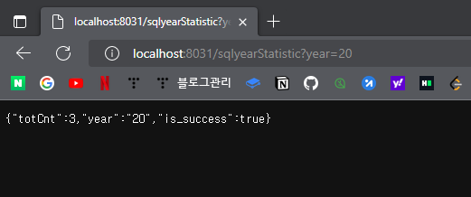

# Back-end-Develop-Practice

## 1st Assignment

<h3> Eclipse, Spring 설치 </h3>

 JDK 1.8 설치 완료 

 

 Eclipse 설치 완료 

 

 Spring 설치 완료 

 

 Tomcat 설치 완료 

 

 mariadb, mysql Workbench 설치 및 샘플 DB 구축 

 

 스프링, Mariadb, MyBatis 연동, 데이터 조회 

 
 POM.xml 수정 완료 

- springframework, java version 수정

- mariaDB, mybatis dependency 추가

- maven-compiler-plugin version 수정

 

 
 root-context.xml 수정 완료 

- xsi:schemaLocation 추가, dataSource 수정

 

 
 mybatis-config.xml, logback.xml, log4jdbc.log4j2.properties, test.xml 작성 완료 

- Resource Tree 

- mybatis-config.xml 

- logback.xml 

- log4jdbc.log4j2.properties 

- test.xml 

 

 
 MovieDAO, MovieService, MovieVO, HomeController 작성 완료 

- Java Tree

- MovieDAO, MovieDAOlmpl 

- MovieService, MovieServicelmpl 

- HomeController

- MovieVO

 

 
 Tomcat Address 수정 완료 

- /settingweb -> / 수정

 

## 2st Assignment

 
 API 문서 초안 작성 

https://brian-jung.gitbook.io/api-docs/eveinformation/eveintroduction

 

## 3st Assignment

<h3> RestController를 활용한 간단 API 구현 </h3>

- RestController를 사용한 간단한 API (20년도 로그인 수)를 구현합니다.
- 본 과정은 Spring Boot를 활용합니다.

 

<h3> 스프링부트 개발 환경 설정하기 </h3>

 
 프로젝트 세팅 완료 

 

- File > New > Project > Spring Boot > Spring Starter Project를 클릭하여 프로젝트 생성합니다.

- API를 만들기 위함이니 Spring Boot Devtools, Spring Web, MyBatis Framework 만 선택합니다.

 

 
 Pom.xml 수정 완료 

- Dependency를 수정합니다. Dependency에는 DB 관련 내용을 포함합니다.

 

 
 application.properties 수정 완료 

- port, contextpath, view, db 등 각종 설정을 한 곳에서 진행합니다.
- 설정 내용은 serverport, contextpath를 진행하였습니다.
- suffix에 jsp를 줌으로써 /WEB-INF/views 아래에 jsp 파일을 자동으로 Mapping해주도록 합니다.

 

 
 기본 TEST 

- test로 호출을 하면 test.jsp로 값을 전달한 화면이 보여짐을 확인할 수 있습니다. 
- 아래와 같이 [src > main] 아래에 webapp, views 폴더를 차례로 만들고 test.jsp를 만듭니다.

- com.devfun.settingweb_boot.test 패키지를 만들고 settingTest.java를 만들어 아래와 같은 컨트롤러를 작성합니다.

- 프로젝트를 실행 후 /test를 호출해봅니다.
- 이때 실행은 SettingwebBootApplication.java에서 실행합니다.
- port는 application.properties에 등록되어 있습니다.
- 최종 URL : http://localhost:8031/test

 

 
 통계(SW활용현황) API를 위한 DB, TABLE 생성 

- mysql Workbench를 이용하여 DB, TABLE을 생성합니다.
- 데이터는 임의로 넣어 사용합니다.

 

 
 Spring Boot, Mybatis, mariadb 연동 

- 최종 URL : http://localhost:8031/sqlyearStatistic?year=20
- 조회하는 URL 임으로 GET으로 조회를 하여 url에 parameter를 입력합니다.
- 그 결과로 아래와 같이 JSON 구조 값이 나옴을 확인할 수 있습니다.

- 아래의 이미지대로 package, mapper, config, settingTest를 작성하여 API를 만듭니다.

 
 mybatis 설정 

- JAVA로도 config 설정이 가능합니다.
- DB와 mybatis를 활용하기 위한 설정 코드를 작성합니다.
- MapperScan 어노테이션을 활용하여 스캔할 패키지를 입력합니다.

 

 
 mapper 작성 

- StatisticMapper interface 작성

- StatisticMapper 안에 쿼리를 정의합니다.
- 대표  restController로 [해당년도의 로그인 수]를 알기 위한 쿼리를 작성합니다.

 

 
 Service (비즈니스 Logic) 작성 

- interface로 yearloginNum을 정의합니다.

- JSON 값을 만들기 위해 HashMap 형태로 Return을 합니다.
- HashMap 값을 year, is_success, 쿼리로 가져온 cnt값으로 JSON 값을 만듭니다.

 

 
 settingTest 코드 추가  

 

## 4st Assignment

 
 통계 API 구축 SQL문 

- 연간 접속자 수
    
    select count(*) as totCnt

	from statistic.requestinfo ri

	where left(ri.createDate, 2) = #{year};

- 월간 접속자 수
    
    select count(*) as totCnt

	from statistic.requestinfo ri

	where left(ri.createDate, 4) = #{month};
- 일간 접속자 수

    select count(*) as totCnt

	from statistic.requestinfo ri

	where left(ri.createDate, 6) = #{day};
- 평균 하루 로그인 수

    select count(*) / DAY(LAST_DAY(STR_TO_DATE(createDate, '%y%m%d%h%i'))) as avgCnt

	from statistic.requestinfo ri

	where left(ri.createDate,4) = #{avgday};
- 휴일을 제외한 로그인 수
- 부서별 월별 로그인 수

 

 
 통계 API 파일 작성 

- DAO
    - <statisticMapper.java>
    
     
    
    
    
    - <statisticMapper.xml>
    
    

- SERVICE
    - <statisticService.java>
    
     
    
    
    
    - <statisticService.xml>
    
     
    
    

- TEST
    - <settingTest.java>
    
     
    
    

 

 
 통계 API 결과값 

- 연간 접속자 수 결과 화면

 

- 월간 접속자 수 결과 화면

 

- 일간 접속자 수 결과 화면

 

- 평균 하루 로그인 수 결과 화면

 

 

 
 최종 API 문서 

https://brian-jung.gitbook.io/api-docs/eveinformation/eveintroduction

 
